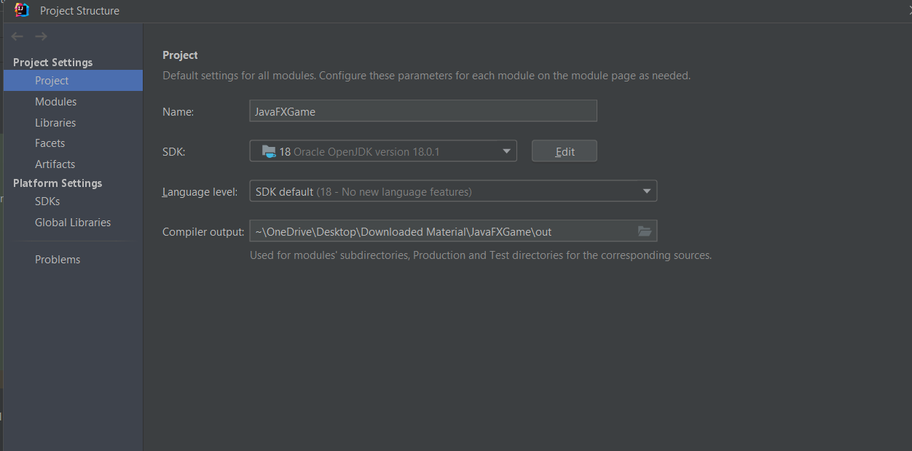
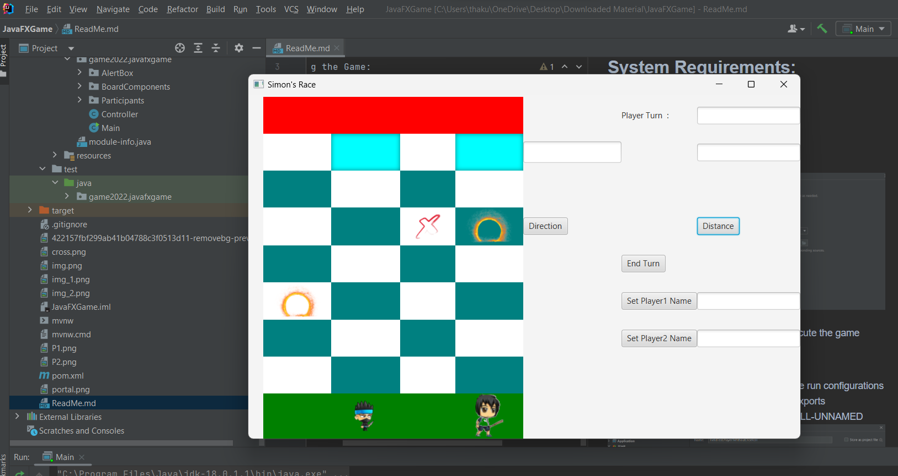
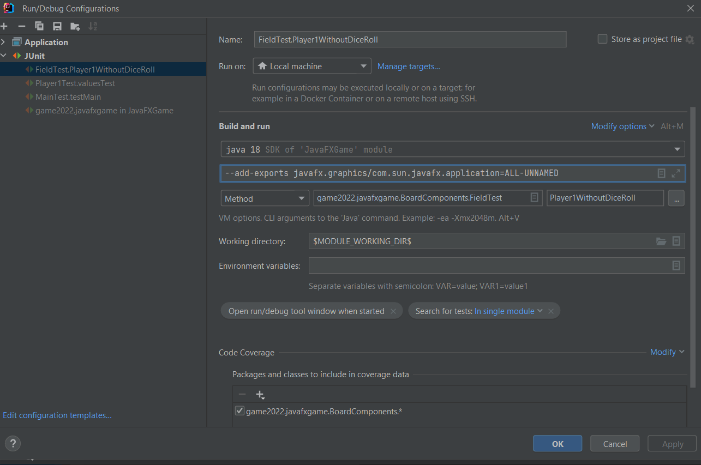

## **System Requirements:**

For Running the Game: 
1. JDK : 18
2. Language Level : 18
3. SDK : 18

4. use intellij and run the main class to execute the game

For Running the testcases :

Note:
1. Please don't touch the mouse after clicking on run test case button as robot will take the input
2. Test cases can only be executed in intellij not using CLI commands in maven
3. Please include the following VM options in the run configurations of intelliJ only
if test cases do not execute
--add-exports javafx.graphics/com.sun.javafx.application=ALL-UNNAMED

